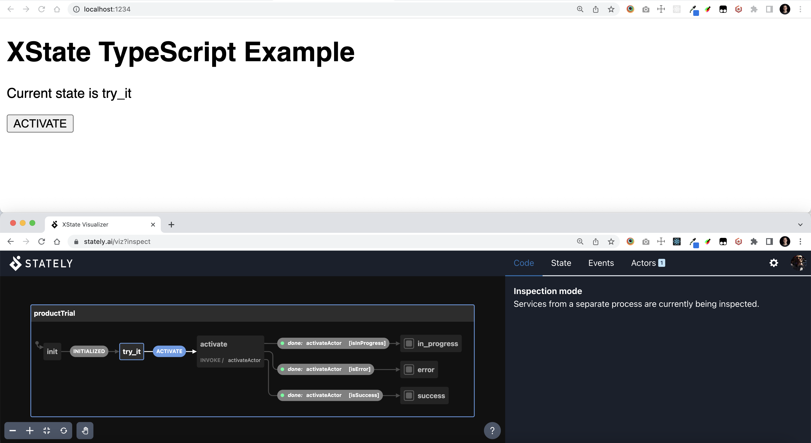

## Quick Start

```bash
npm run start
```

Visit [http://localhost:1234/](http://localhost:1234/)

This will also automatically open a new popup window for the Stately visual inspector at https://stately.ai/viz?inspect.


